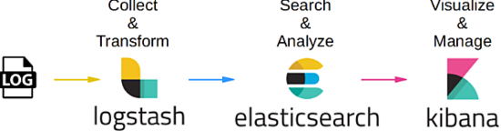

## Giới thiệu về ELK Stack 

### 1. Tổng quan về ELK Stack

#### Khái niệm về ELK Stack 
Trước tiên, khi muốn hiểu về ELK Stack chúng ta cần phải hiển  thế nào là Stack . Stack là một tập hợp nhiều ứng dụng hay phần mềm có chức năng khác nhau để tạo thành một ứng dụng hoàn chỉnh có thể hoạt động được và phục vụ một yêu cầu nào đó.

ELK Stack : là một tập hợp gồm các phần mềm kết hợp lại nhằm mục đích phục vụ cho việc làm việc với logging. Các phần mềm lần lượt là :
- Elasticsearch : là một phần mềm có chức năng như database dùng để lưu trữ data, do có chức năng như database nên Elasticsearch cũng có thể tìm kiểm và query log. 
- Logsash: là nơi nhận log từ nhiều nơi và xử lý log sau đó gửi và lưu trữ tại Elasticsearch.
- Kibana: là giao diện của ELK Stack dùng để đọc các log trong Elasticsearch và hiển thị cho người dùng. 

#### Mô hình hoạt động của ELK Stack 

**Step 1**: Khi có log gửi đến ELK Server, Logstash là nơi tiếp nhận log từ nhiêu nơi khác nhau gửi đến. 

**Step 2**: Khi nhận được log Logstash sẽ tiến hành phân loại và xử lý log( phân tích một log không có cấu trúc cụ thể thành log có cấu trúc cố đinh và dễ hiểu ) thêm thông tin như thời gian, IP,.. của log và sau đó gửi log lên lưu trữ tại Elasticsearch.

**Step 3**: Khi muốn xem, thống kê Logs chúng ta sẽ truy cập vào Kibana,khi đó Kibana sẽ đọc thông tin về log trong Elasticsearch và hiển thị lên cho người dùng. 

[BACK](../README.md)
